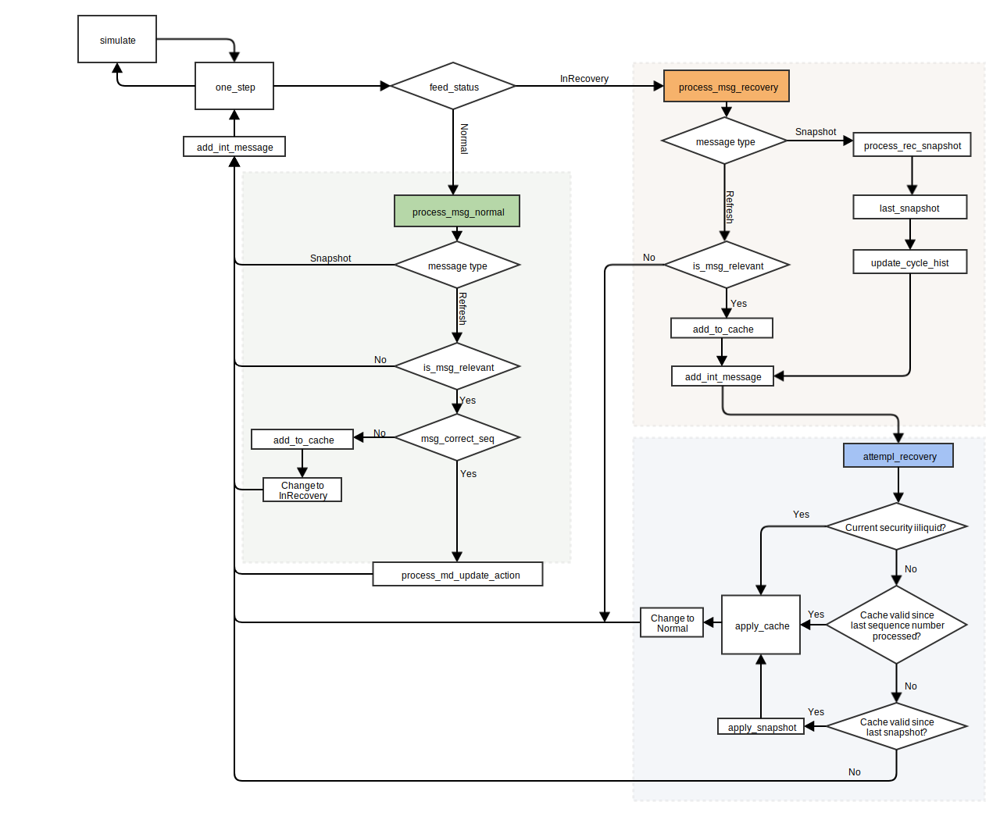

---
## Overview

The CME Group Market Data Platform (MDP) disseminates market data for CME Group
markets.  The client state is updated in real time with an ordered stream of
Incremental Refresh messages.  These messages are encoded using Simple Binary
Encoding (SBE), gathered in packets, and are sent over two redundant UDP
connections: Incremental Refresh A and Incremental Refresh B. This redundancy
is needed to reduce the chance of packet loss in the UDP.

Furthermore, there is another pair of UDP feeds: Market Recovery A and Market Recovery B.
The recovery feeds are used to disseminate market data snapshots of the active
books. These snapshot messages can be used to recover from a possible loss of
Incremental Refresh packets from both of the incremental channels.


Generating test cases JSON files using `imandra-analyser`
```bash
imandra-analyser-cli strategy.yaml | python extract_packets.py generatedJsons

```

Starting the packets and transitions visualizer on http://localhost:8000

```
cd visualizer/
python -m SimpleHTTPServer
```

## Imandra model of the CME book-builder  
We model the CME book-builder as an infinite state machine. The `feed_state`
datatype contains all of the information about CME book-builder state:

- `feed_sec_type` : the ID of the security that the exchange is working on.
- `books` : current state of books in the exchange
- `channels` : state of the communication channels. Contains a sequence of
  incoming unprocessed packets in the chronological order, a sequence of
  already processed packets, latest received snapshot, an ordered set of cached
  packets for recovery and a pair of `cycle_history` structures for channels A
  and B.
- `feed_status` : the current status of the feed can be either `Normal` or
  `InRecovery`.
- `internal_changes` : stores all the internal changes in the algorithm - how
  books are updated with every message, current state of the cache and cycle
  histories, whether the status is `Normal` or `InRecovery`, e.t.c.
- `cur_time`: the timestamp of last processed packet

The model takes the next packet from the list of unprocessed packets and
iterates over the messages in it. 

In the `Normal` state, the message sequence number is checked and the message
is either processed normally or, if the message is off-sequence, added to cache
with the feed transitioning to the `InRecovery` state. 

While `InRecovery`, incremental update messages are added to cache, and
snapshot messages are saved as a `last_snapshot`. After each message a recovery
is attempted:  if all cached messages are in chronological order since last
snapshot -- the feed transitions back into the `Normal` state:



The flowchart diagram above gives an overview of the 

- **`simulate`** : a toplevel function that recursively
  applies the `one_step` function until `feed_state` is not changed by it.
- **`one_step`** : performs one step of the simulation
  of the `feed_state`. The function extracts the next message from the stream
  of incoming packets and forwards it either to `process_msg_normal` and
  `process_msg_recovery`, depending on the current `feed_status`. If we are
  currently `InRecovery`, then recovery is attempted (via `attempt_recovery`)
  after the message is processed.
- **`process_msg_normal`** :  processes the next
  message, when our feed is in the `Normal` state. All snapshot messages are
  ignored. If a refresh message `is_msg_relevant` and has the sequence number
  that is exactly (`last_processed + 1`), then it is applied to the books in the
  exchange. If there is a gap in the sequence number, then the `feed_status` is
  changed to `InRecovery`.
- **`is_msg_relevant`** : used by the previous
  function, it checks whether the next incremental refresh message is
  "relevant": its security ID equals to this feed's security, if its sequirity
  sequence number is greater that the last processed one and if the order level
  number is smaller than the book size of the feed. 
- **`process_md_update_action`** : applies the
  current incremental refresh action (could be creation, deletion or update of
  some order) to the books in the exchange.
- **`process_msg_recovery`** : processes the
  next message, when our feed is `InRecovery`. The incremental refresh messages
  are placed in the cache (cache is kept sorted). The snapshots for "our"
  security are stored, and the snapshot for the "reference" security are used
  to detect whether our security is `Liquid` or `Illiquid`.
- **`attemp_recovery`** : there are three possibilities
  for the status to change back from `InRecovery`


## Simple Binary Encoding  
The Simple Binary Encoding (SBE) is a binary encoding format for
serialization/deserialization of a sequence of hierachically structured
messages in a stream of raw binary data.  

In the SBE framework, one first defines an *XML schema* -- an XML description
the binary layout of the messages.  Typically, a special codegenerating tool
then reads this XML file, and produces a code (usually `Java` or `C++`) that
contains the message type declarations and read/write routines for them. The
generated code can then be linked with the business logic software.  

In this chapter we'll describe such a code-generation tool for the OCaml
programming language.
 
## SBE types codegeneration 

At the root of it, SBE relies on a small number of common types:
ASCII-characters, signed or unsigned integers of various sizes and IEE754
floating-point numbers. 
    
In the XML schema any such 'primitive' type might be augmented by one of the
following modifiers:

- It can have a `nullValue`, which denotes the null or none value for the
      field of that type. 
- It can have an associated `length` value, meaning that the given field is
      a sequence of values of that type. 
- It can have a `constant`  "presence" -- in that case the corresponding
      field is never read or written to the binary stream.  Instead, the field
      is always equal to a constant value, provided in the XML file.

The following conversions between the SBE simple types and their modifiers is
used.

| SBE Type    | OCaml type  |
| ----------- | ----------- |
| int8        | int         |
| int16       | int         |
| int32       | Int32.t     |
| int64       | Int63.t     |
| char        | char        |


| SBE type modifier | OCaml parametrized type |
| ----------------- | ----------------------- |
| length            | 'a list                 |
| nullValue         | 'a option               |

Three kinds of "complex" types can then be constructed based on the primitive
types described above:

- The `composite` type is a sequence (a record) of fields of various types.  
- The `enum` represents a number of mutually-exclusive cases. Each case
      encoded with a constant `case-id`, provided in the XML schema.
- The `set` is a collection of boolean fields, packed into a single bit
      field.  

For `enum` and `set` types, an `encodingType` name must be provided.

The composite types are represented as OCaml record-types with
each record entry having the corresponding primitive type. 

```xml
<composite name="FLOAT">
    <type name="mantissa" primitiveType="int64"/>
    <type name="exponent" primitiveType="int"/>
</composite>
```
```ocaml
type t_FLOAT = {
     f_FLOAT_mantissa : int64;
     f_FLOAT_exponent : int
}
```

The enum types are represented as OCaml variant-types (2a) with each variant
case being a constant.

```xml
<enum name="LegSide" encodingType="uInt8">
    <validValue name="BuySide" >1</validValue>
    <validValue name="SellSide">2</validValue>
</enum>
```
```ocaml
type t_LegSide =
     | V_LegSide_BuySide
     | V_LegSide_SellSide
 ```

If the `enum` type has a nullable `encodingType`, then one extra case is added to the variant.  

```xml
<enum name="AggressorSide" encodingType="uInt8NULL">
    <validValue name="NoAggressor">0</validValue>
    <validValue name="Buy">1</validValue>
    <validValue name="Sell">2</validValue>
</enum>
```

```ocaml
type t_AggressorSide =
    | V_AggressorSide_NoAggressor
    | V_AggressorSide_Buy
    | V_AggressorSide_Sell
    | V_AggressorSide_Null
```

Finally, the set types are treated as records, but with all entries
being of the `boolean` type.

```xml
<set name="SettlPriceType" encodingType="uInt8">
    <choice name="Final">0</choice>
    <choice name="Actual">1</choice>
</set>
```

```ocaml
type t_SettlPriceType = {
    r_SettlPriceType_Final : bool;
    r_SettlPriceType_Actual : bool;
}
```
In the XML schema, the declaration of all the necessary simple and complex
types is followed by the declaration of various messages. Each message contains
a block of fields that are always present in the message, followed by a number
of variable-sized groups. Each group is stored as a sequence of repeated
blocks, with each block containing the same fixed number of fields.

## The `cme_codegen` tool

The OCaml codegenerator takes as an input the XML schema file (set with `-i`
flag) and writes three files into a specified directory (set with `-d` flag)

```bash
$ _build/default/src-codegenerator/cme_codegen.bc -i templates.xml -d outputdir
$ ls outputdir
message_types.ml  readers.ml  writers.ml
```

The `message_types.ml` file contains all the OCaml type declarations. At the
very bottom of the file, the `message` type is declared -- it encompasses all
the messages in a single variant type.

The `readers.ml` and `writers.ml` files contain the reading and writing
routines for various types, for individual messages and for the top-level
`Message_types.message`. 


