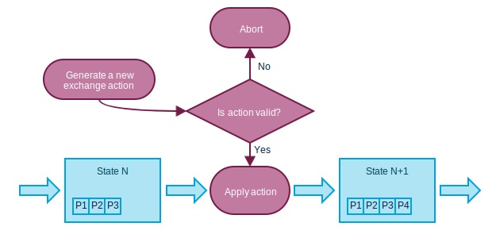
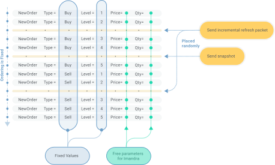
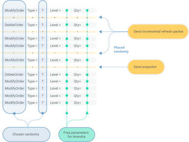
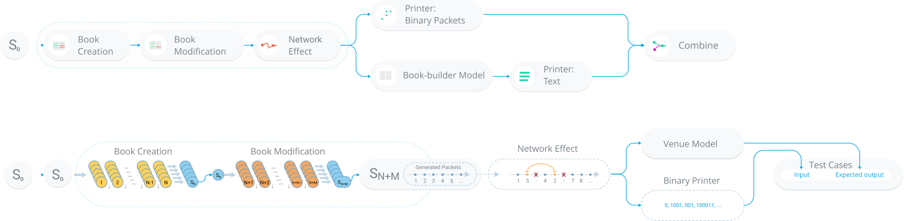

## Problem of tests generation for event-driven algorithms
Sometimes one wants to generate tests for algorithms that process sequences of
some kind of events: it could be instructions in some VM, system messages or
network packets. In such cases the number of possible combinations of the
incoming events becomes astronomically large even for short sequences.  Without
any additional constraints, Imandra will attempt to explore the space of all
possible combinations of events. The number of possible combination grows
exponentially, quickly becoming infeasible to deal with even for a reasonably
small number of events. 

To tackle this problem we have developed a "pipeline" approach for the test
suite generation: the generation is broken into several configurable steps,
with each step generating a small amount of events.  A representation of an
internal state of the algorithm is passed between the steps:



## CME Exchange model 
The `CME_Exchange` is a model used to generate sequences of packets for the CME
model. The model takes in a sequence of actions and, if the sequence is_valid,
generates a sequence of outgoing packets. Every action can either result in
creation of a security-related message, stored in the model state, or it can
result in the list of the stored messages being sent as a packet. The model
stores the sequence numbers of the messages ( each security has its own) and
sequence numbers of the packets.

In more details, the state of the exchange model contains:
- **`sec_a`** and **`sec_b`** : security states for two simulated securities
- **`inc_msg_queue`** : list of Incremental Refresh messages that are to be sent in the next refresh packet
- **`snap_msg_queue`**  – list of Snapshot messages that are to be sent in the next snapshot packet
- **`last_inc_seq_num`** – last packet sequence number for refresh channels
- **`last_snap_seq_num`** – last packet sequence number for snapshot channels
- **`pac_queue`** – list of generated packets
The security state structure contains:
- **`last_rep_seq`_num`** -  this security RptSeqNumber incremented with each message
- **`sec_id`** – numerical ID of the security 
- **`multi_book`** and **`implied_book`**  – the state of the two books 

For the books we are storing five levels for buy and sell sides:
```ocaml
type book_side = {
    one : order_level;
    two : order_level;
    three : order_level;
    four : order_level;
    five : order_level;
};;
type order_book = {
    buy_orders : book_side;
    sell_orders : book_side;
};;
```

There are two general types of exchange actions (or, as they called in the code, internal transitions): 
the book transitions are events that modify orders in the book, and exchange transitions:

```ocaml
type book_transition =
	| ST_Add of ord_add_data (* Add order book level *)
	| ST_Change of ord_change_data (* Cancel an order in the book *)
	| ST_Delete of ord_del_data (* Delete book level *)
;;
type exchange_transition =
	| ST_BookReset (* We reset the whole book *)
	| ST_DataSendInc (* Indicates that we need to send out the collected incremental refresh messages *)
	| ST_DataSendSnap (* Indicates that we need to send out the collected snapshot refresh messages *)
	| ST_Snapshot of sec_type (* Indicates the need to send a snapshot message *)
;;
```

## CME test suite generation

We apply the ideas described above to the generation of a test suite for the
CME model.  The "pipeline" in this case is made of three steps: 


### Step 1. Book Generation.

The purpose of the first step is to generate exchange books -- a sequence of
`NewOrder` messages is generated. The quantity and price of the newly created
orders are left as free parameters, explored by Imandra.  The sequence of the
`NewOrder` events is randomly interspersed with `SendIncrementalRefresh` and
`SendSnapshot` events -- these are used to create packets in the incremental
refresh and snapshot refresh channels correspondingly.  



### Step 2. Book modification.

At the second step, the books are modified with `ModifyOrder` and `DeleteOrder`
events. The sequence of events is chosen randomly, while the new quantity and
the level number are left as free parameters, for Imandra to explore.  As in
the previous step, the generated `ModifyOrder` and `DeleteOrder` events are
also randomly interspersed with `SendIncrementalRefresh` and `SendSnapshot`
events.



### Step 3. Network effects.

The third and final generation step simulates possible network effects that
might affect the sequence of packets, received by the exchange. Packets may get
lost or come in a wrong order. We produce all possible combinations of such
network effects for the five first packets in the network.




## Imandra Analyser and test generation strategy YAML configuration file
